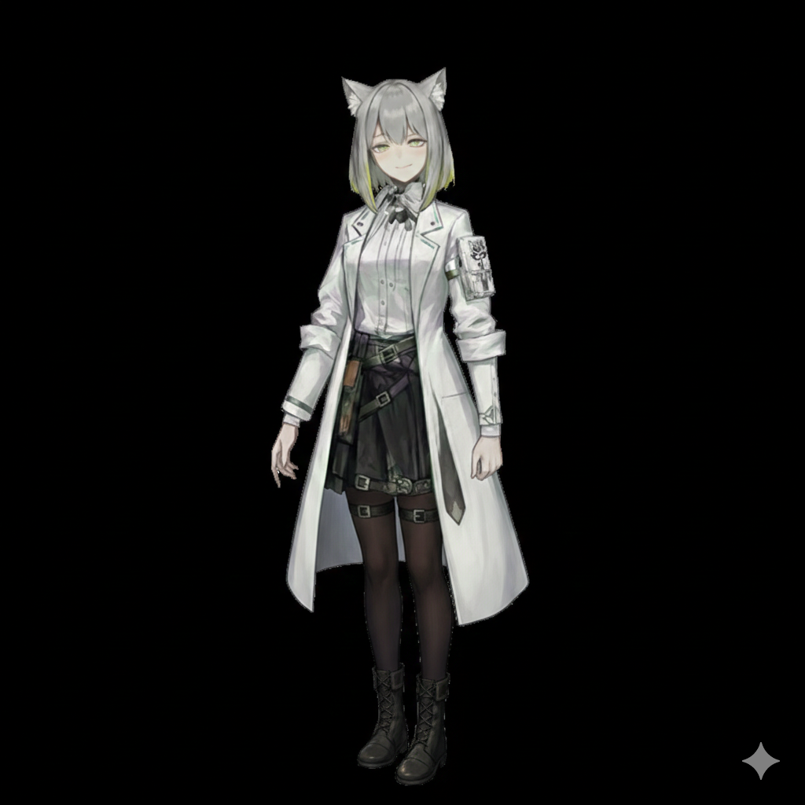



  

  
  
  

 

<table width="100%" style="border-collapse: collapse; border: none;">
  <tr>
    <td width="55%" valign="top" style="border: none;">
      <!-- Terminal Info Block -->
      <h3><code>[01] // TERMINAL_INFO</code></h3>
      <pre lang="text" style="padding: 15px; border-left: 5px solid #A2E02B; border-radius: 4px;">
Name   : Gunian7
Bio    : To have Noir by my side.
Status : Active / Building</pre>

       

      <!-- Interests Block -->
      <h3><code>[02] // DOMAINS &amp; INTERESTS</code></h3>
      <ul>
        <li>✨ Exploring <b>System Architecture</b> and Engineering Quality.</li>
        <li>🎨 Building creative <b>Developer Tools</b>.</li>
        <li>💻 Writing code that is robust, clean, and practical.</li>
      </ul>
    </td>

    <td width="45%" align="center" valign="middle" style="border: none;">
      <!-- Anime Character Slot -->
      
       
      <i>✦ 专属看板配置</i>
    </td>
  </tr>
</table>

 

---

### <code>[03] // TECH_STACK</code>

  
  
  
  
  

### <code>[04] // GITHUB_ANALYTICS</code>

  
  

  

---

### <code>[05] // COMM_SIGNAL</code>

- 📧 **Email:** <a href="mailto:1328037882@qq.com">1328037882@qq.com</a>
- 🔗 **GitHub:** <a href="https://github.com/Gunian7">@Gunian7</a>

   
  Styled via Colorful Terminal Layout

